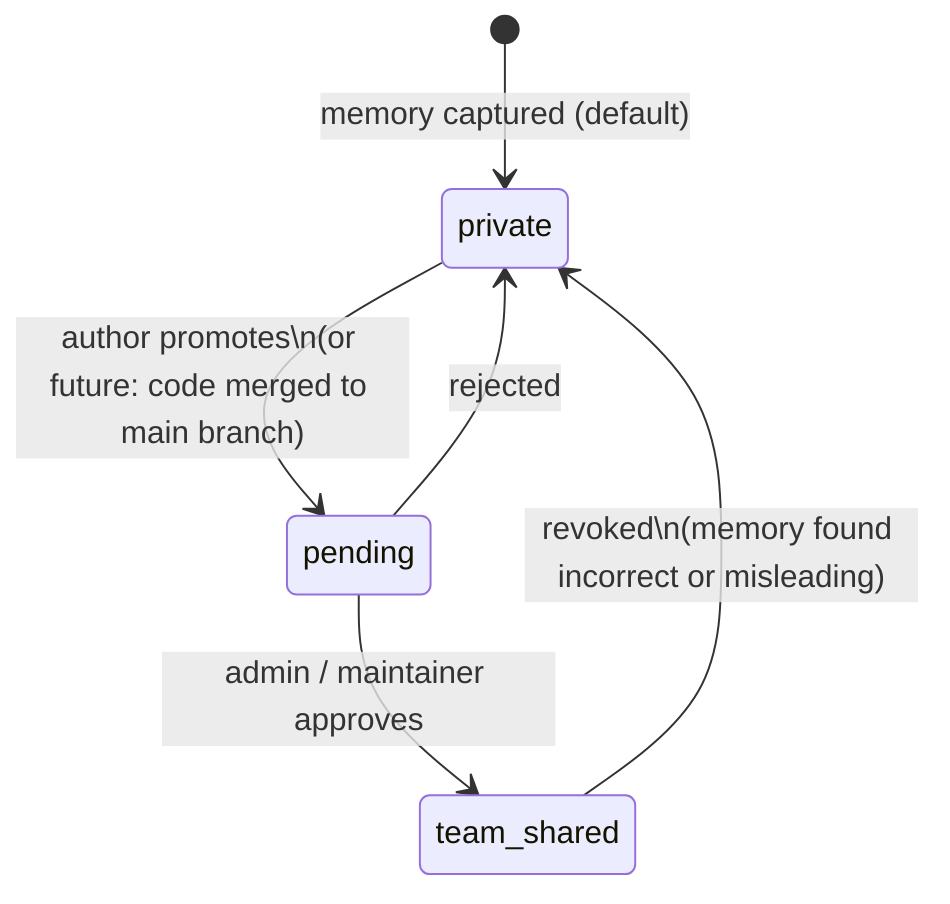
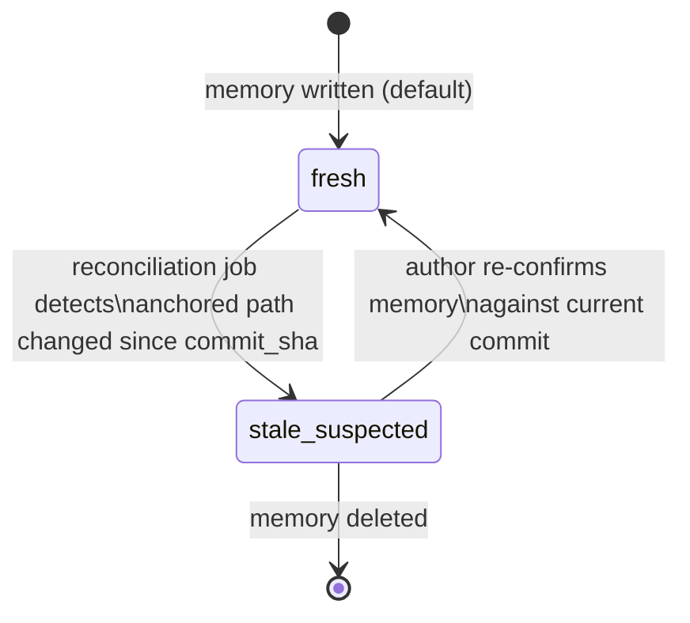
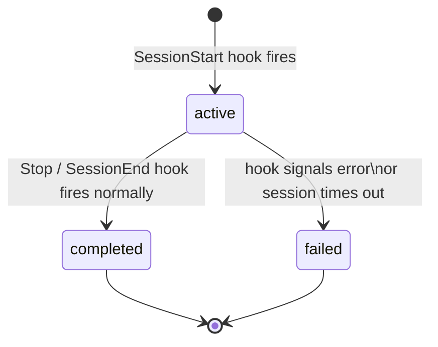
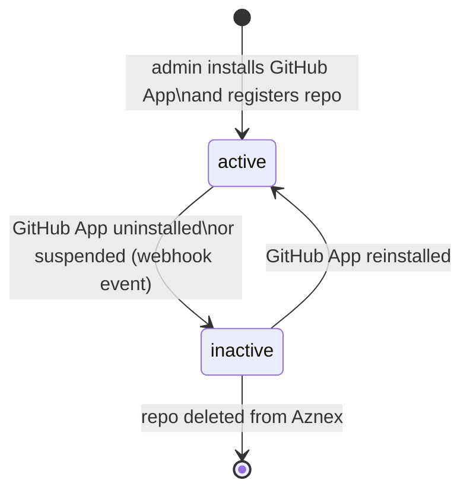
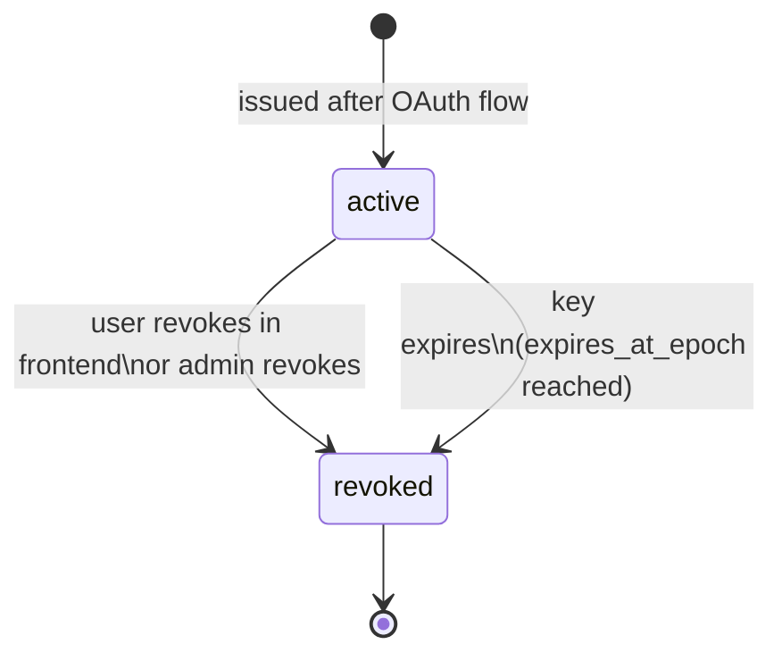

# Data Lifecycle

State machines for every entity that has a lifecycle in Aznex. Immutable entities (e.g. `AgentEvent`, `MemoryAnchor`) are not listed — they are written once and never mutated.

---

## Memory — `promotion_state`

Controls visibility. Captured memory starts private to its author and must be explicitly promoted before the team can see it.



| State | Who can read | Writable by |
|---|---|---|
| `private` | Author only | Author |
| `pending` | Author + admins | Author, admin |
| `team_shared` | All repo members (via MCP) | Admin only |

**Notes:**
- Only `team_shared` memories are returned by `search_memory` and `get_recent_context` MCP calls.
- The merge-to-main auto-promotion path (future, Phase 2) promotes to `pending`, not directly to `team_shared` — a human still approves.
- Revoking (`team_shared → private`) is a safety valve for when a memory is discovered to be wrong or contain sensitive content that slipped past the secret scanner.

---

## Memory — `freshness_state`

Tracks whether the code a memory refers to has changed since the memory was captured.



**Trigger:** the reconciliation job runs when a push arrives on the repo's default branch (via GitHub webhook, Phase 2) or on a scheduled poll. It compares each `memory_anchor.commit_sha` against the current HEAD commit for that path.

**At read time:** `stale_suspected` memories are flagged in results and excluded by default (`include_stale: false`). Agents and the frontend should surface the flag rather than silently drop the memory.

---

## Session — `status`

One session per agent run. Progresses linearly; no going back from terminal states.



**Notes:**
- Sessions in `active` state older than a configurable TTL (e.g. 24 h) should be reaped to `failed` by a background job — agents can crash without firing `SessionEnd`.
- `AgentEvent` rows are written throughout the `active` state. They are immutable once written.
- Memory extraction and POST to the service happen asynchronously after the worker receives hook payloads — a session may be `completed` before all its memories are persisted.

---

## Repo — `status`

Reflects whether the GitHub App installation covering this repo is active.



**Notes:**
- While `inactive`, the service rejects new ingest requests for the repo (`403`).
- Existing memories are preserved — they are not deleted when the repo goes inactive.
- `repo_members` cache is not synced while `inactive`; stale entries remain until the repo becomes `active` again and a sync runs.

---

## ApiKey — `status`

Revocation is permanent — there is no un-revoke.



**Notes:**
- The service checks `status = 'active'` and `expires_at_epoch` on every authenticated request. Revoked or expired keys get `401`.
- `last_used_at_epoch` is updated on each successful auth — useful for auditing dormant keys.
- Keys are user-scoped, not repo-scoped. A revoked key loses access to all repos simultaneously.

---

## RepoMember — sync lifecycle

Not a state machine — entries are replaced wholesale on each sync. Shown here because the timing matters for access decisions.

```
GitHub collaborators list
        │
        │  periodic sync job (or on-demand after install / push event)
        ▼
repo_members table   ←──── reads on every ingest / MCP request
        │
        │  entry removed if user no longer has repo access
        ▼
     (deleted)
```

**Notes:**
- Access decisions are made against the cached `repo_members` table, not live GitHub API calls.
- Cache lag is a known tradeoff: a user removed from GitHub may retain access until the next sync cycle. Set the sync interval conservatively (e.g. every 15 min) to bound the window.
- On GitHub App installation, a full sync runs immediately.
