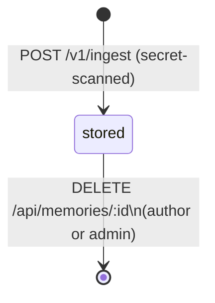
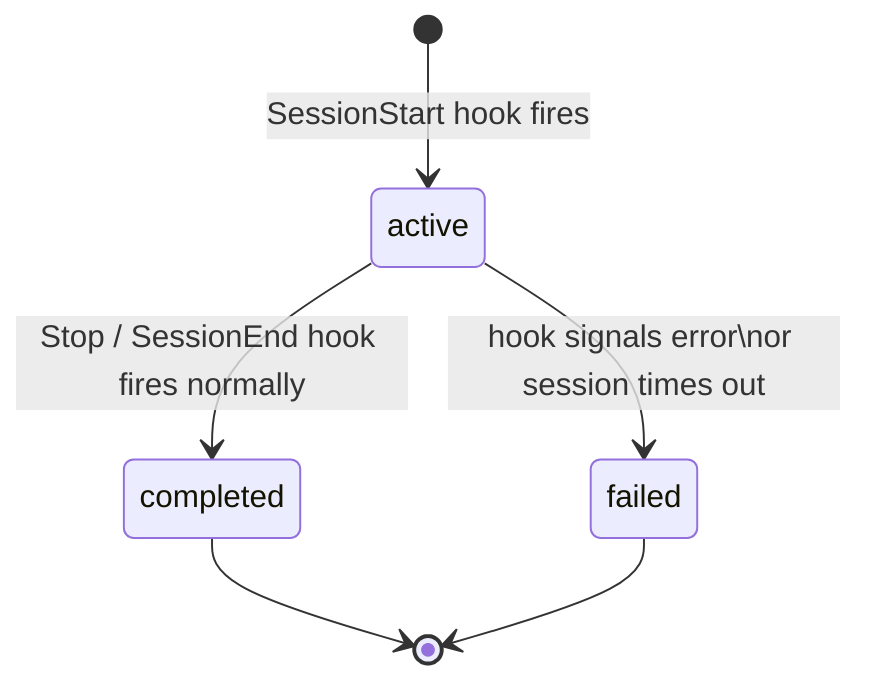
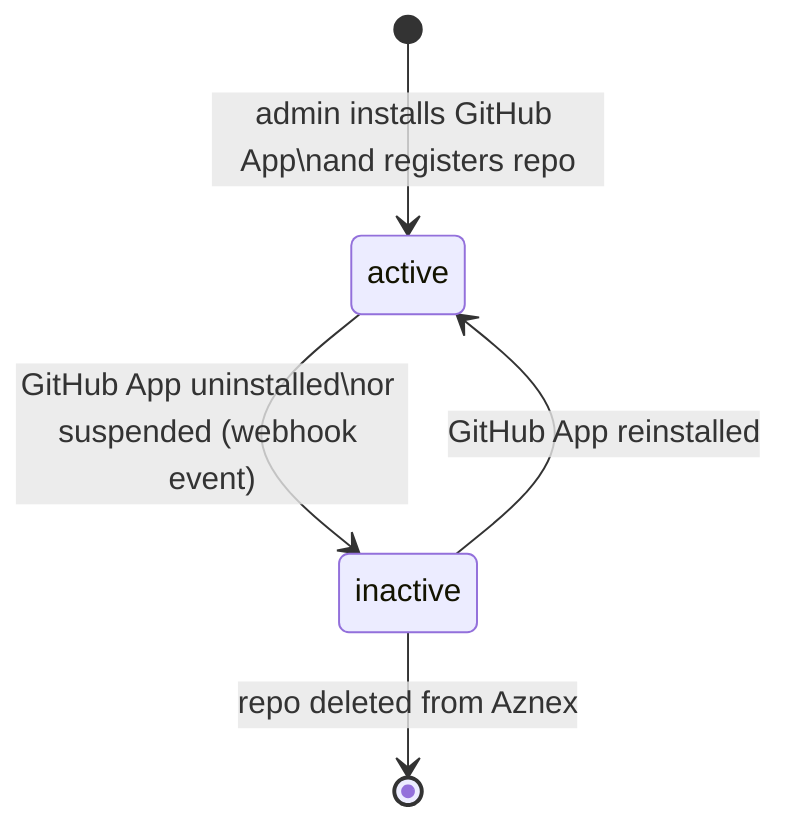
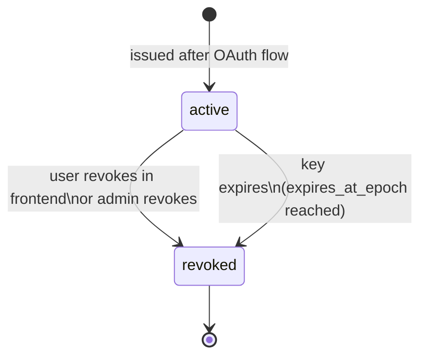

# Data Lifecycle

State machines for every entity that has a lifecycle in Aznex. Immutable entities (e.g. `AgentEvent`, `MemoryAnchor`) are not listed — they are written once and never mutated.

`Memory` itself has no lifecycle: it is shared with the whole repo the moment it lands, and the only transition is deletion. See below.

> **Implementation status:** the states and enums below match the code exactly. A few *transitions* are executed by components that are still planned rather than built: GitHub webhook handling (repo `active ↔ inactive`), the repo-member sync job, and the session reaper. Everything else is live.

---

## Memory — no lifecycle

A memory has no visibility or freshness state. It is created by ingestion, readable by everyone with access to its repo from that moment, and deleted or not.


```mermaid
stateDiagram-v2
    [*] --> stored : POST /v1/ingest (secret-scanned)
    stored --> [*] : DELETE /api/memories/:id\n(author or admin)
```

**Notes:**
- Repo access is the only read gate. `search_memory`, `get_recent_context`, `get_memories_by_path` and the viewer all return everything captured against the repo, whoever captured it — one shared context per repo is the product.
- Deletion is the safety valve for a memory that is wrong, misleading, or leaked something past the two secret scanners. It is a hard delete: anchors cascade and the FTS row is dropped by trigger.
- Promotion (`private → pending → team_shared`) and freshness (`fresh / stale_suspected`) were removed. Promotion was a no-op in every deployment and the staleness engine was never built; both could only hide memory from the team.

---

## Session — `status`

One session per agent run. Progresses linearly; no going back from terminal states.


```mermaid
stateDiagram-v2
    [*] --> active : SessionStart hook fires

    active --> completed : Stop / SessionEnd hook fires normally
    active --> failed : hook signals error\nor session times out

    completed --> [*]
    failed --> [*]
```

**Notes:**
- Sessions in `active` state older than a configurable TTL (e.g. 24 h) should be reaped to `failed` by a background job — agents can crash without firing `SessionEnd`.
- `AgentEvent` rows are written throughout the `active` state. They are immutable once written.
- Memory extraction and POST to the service happen asynchronously after the worker receives hook payloads — a session may be `completed` before all its memories are persisted.

---

## Repo — `status`

Reflects whether the GitHub App installation covering this repo is active.


```mermaid
stateDiagram-v2
    [*] --> active : admin installs GitHub App\nand registers repo

    active --> inactive : GitHub App uninstalled\nor suspended (webhook event)
    inactive --> active : GitHub App reinstalled

    inactive --> [*] : repo deleted from Aznex
```

**Notes:**
- While `inactive`, the service rejects new ingest requests for the repo (`403`).
- Existing memories are preserved — they are not deleted when the repo goes inactive.
- `repo_members` cache is not synced while `inactive`; stale entries remain until the repo becomes `active` again and a sync runs.

---

## ApiKey — `status`

Revocation is permanent — there is no un-revoke.


```mermaid
stateDiagram-v2
    [*] --> active : issued after OAuth flow

    active --> revoked : user revokes in frontend\nor admin revokes
    active --> revoked : key expires\n(expires_at_epoch reached)

    revoked --> [*]
```

**Notes:**
- The service checks `status = 'active'` and `expires_at_epoch` on every authenticated request. Revoked or expired keys get `401`.
- `last_used_at_epoch` is updated on each successful auth — useful for auditing dormant keys.
- Keys are user-scoped, not repo-scoped. A revoked key loses access to all repos simultaneously.

---

## RepoMember — sync lifecycle

Not a state machine — entries are replaced wholesale on each sync. Shown here because the timing matters for access decisions.

```
GitHub collaborators list
        │
        │  periodic sync job (or on-demand after install / push event)
        ▼
repo_members table   ←──── reads on every ingest / MCP request
        │
        │  entry removed if user no longer has repo access
        ▼
     (deleted)
```

**Notes:**
- Access decisions are made against the cached `repo_members` table, not live GitHub API calls.
- Cache lag is a known tradeoff: a user removed from GitHub may retain access until the next sync cycle. Set the sync interval conservatively (e.g. every 15 min) to bound the window.
- On GitHub App installation, a full sync runs immediately.
